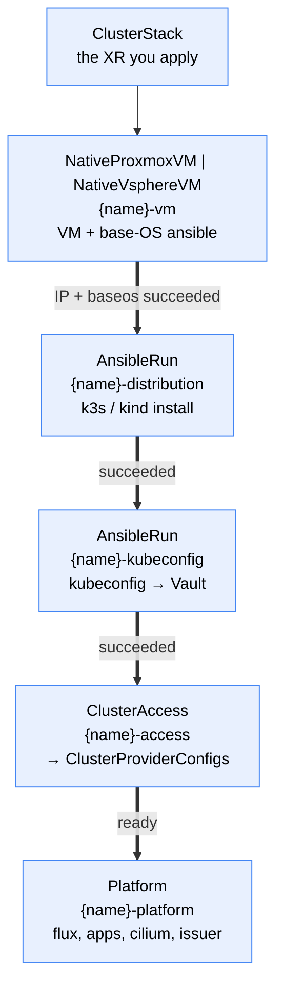

# cluster

A Crossplane v2 Configuration that builds a whole Kubernetes cluster — machine, distribution, access, platform — from a single namespaced `ClusterStack` XR (group `config.stuttgart-things.com`).

## Why

Standing up `u26-kind1` today means hand-writing and hand-correlating **five** XRs across two repos:

| # | Object | File (stuttgart-things/crossplane) |
|---|---|---|
| 1 | `NativeProxmoxVM` (+ baseos) | `xrs/proxmoxvm/labul/kind1/nativeproxmoxvm-u26-kind1.yaml` |
| 2 | `AnsibleRun` — k3s + Cilium | `xrs/ansiblerun/labul/kind1/ansiblerun-k3s-u26-kind1.yaml` |
| 3 | `AnsibleRun` — kubeconfig → Vault | `xrs/ansiblerun/labul/kind1/ansiblerun-kubeconfig-vault-u26-kind1.yaml` |
| 4 | `RemoteCluster` | `xrs/proxmoxvm/labul/kind1/remotecluster-u26-kind1.yaml` |
| 5 | `Platform` | `xrs/proxmoxvm/labul/kind1/platform-u26-kind1.yaml` |

That is ~250 lines in which `u26-kind1` is repeated **8×** and the VM IP `10.31.102.108` **3×** — all by hand, all after the fact, because the IP is only knowable once the VM exists.

The point of this Configuration is **not** less YAML. It is that the IP and the name stop being copy-paste facts:

- the **VM IP** is discovered from the VM child and threaded into both ansible inventories;
- **`clusterName`** becomes the VM name, the guest hostname, the ansible `cluster_name`, the Vault path, the `ClusterAccess` name and `Platform.clusterName`;
- **`platform.cni.enabled`** is derived from the distribution rather than restated.

## Usage

```yaml
apiVersion: config.stuttgart-things.com/v1alpha1
kind: ClusterStack
metadata:
  name: u26-kind1
  namespace: crossplane-system
spec:
  provider: proxmox
  size: medium
  distribution: k3s
  environmentConfig: labul
  platform:
    fluxInit: {enabled: true}
    ipReservation: {enabled: true, createDNS: true}
```

`provider` is the only required field. See [`examples/xr-min.yaml`](examples/xr-min.yaml) (defaults only), [`examples/xr.yaml`](examples/xr.yaml) (reproduces `u26-kind1`), [`examples/xr-max.yaml`](examples/xr-max.yaml) (every field, vSphere + kind).

## What gets created



Everything is a **child XR** — this Configuration never talks to a provider itself. Plus three `Usage` resources for teardown ordering.

| Depth | Resource | Name | From |
|---|---|---|---|
| 0 | `ClusterStack` | *yours* | you |
| 1 | `NativeProxmoxVM` / `NativeVsphereVM` | `{name}-vm` | [proxmoxvm](../../machinery/proxmoxvm/) / [vspherevm](../../machinery/vspherevm/) |
| 1 | `AnsibleRun` ×2 | `{name}-distribution`, `{name}-kubeconfig` | [ansible-run](../../cicd/ansible-run/) |
| 1 | `ClusterAccess` | `{name}-access` | [remote-cluster](../remote-cluster/) |
| 1 | `Platform` | `{name}-platform` | [platform](../platform/) |
| 1 | `Usage` ×3 | `platform-uses-vm`, `platform-uses-access`, `access-uses-vm` | core Crossplane |

## Gates: sticky, and keyed on success

Each stage opens when the previous one **succeeded** — not when it is Ready. An `AnsibleRun` whose PipelineRun failed still reports Ready once its Object is applied; unblocking on that would upload a kubeconfig from a cluster that was never installed.

Every gate is also **sticky**: `(previous succeeded) OR (this child already exists)`. Not emitting a composed resource is what makes Crossplane *delete* it, and bpg / VMware Tools read the VM address from the guest agent — so a momentarily empty value is normal, and without stickiness a blip would delete an `AnsibleRun` whose recreation re-runs the play against a live machine. The `AnsibleRun` children are additionally re-emitted **verbatim** from observed state, because a rebuild during that same blip would rewrite the inventory to an empty IP.

`status.stage` is the single field to look at when a build is stuck:

```console
$ kubectl get clusterstack -n crossplane-system
NAME        READY   STAGE      PROVIDER   DISTRIBUTION   ENDPOINT                     AGE
u26-kind1   true    ready      proxmox    k3s            https://10.31.102.108:6443   40m
```

## Turning the platform layer off

`spec.platformEnabled: false` stops once the cluster is targetable (ClusterAccess ready) — the useful shape for a machine that only needs to exist and be reachable. It is deliberately a **sibling** of `spec.platform` rather than a key inside it: `platform` is a verbatim passthrough of the `Platform` XRD's spec, and a block that preserves unknown fields must not also declare known ones, or schema converters emit `additionalProperties: false` and reject every passthrough key.

## What you cannot set

- **`platform.cni.enabled`** — derived from the distribution's CNI ownership. k3s installs cilium itself (its config disables flannel and kube-proxy, so the role *must*); kind is built deliberately without one. Setting it by hand is how a cluster ends up with two CNIs. Your other `cni` keys (chart version, values) pass through untouched.
- **`platform.clusterName`** — supplied from `clusterName`.
- **Placement** — node, datastore, bridge, vlan, pool (Proxmox) or the MOIDs (vSphere) live in the per-environment `EnvironmentConfig`. Keeping them out is what makes `provider` a one-word switch rather than a second placement API.

## Immutable fields

`provider`, `clusterName`, `distribution` and `size` are rejected on update by CEL. The first three are obvious; `size` is blunt on purpose — a size carries a control-plane node count, and CEL cannot see the catalog to tell a cpu change (in place) from a node-count change (a rebuild). Day-2 scaling is [#172](https://github.com/stuttgart-things/crossplane-configurations/issues/172).

`vm.templateVmId` / `vm.templateUuid` are create-only in the underlying providers: changing either forces delete+recreate rather than a re-clone.

## Deliberate re-runs are per stage

```yaml
runIDs:
  kubeconfig: "2"    # re-runs the upload only
```

Bumping a stage's id suffixes its `PipelineRun` and wrapped Object, which is what makes provider-kubernetes create a *new* run — a completed Tekton `PipelineRun` is immutable and the wrapped Object excludes `Update`, so editing anything else is a **silent no-op** (see [ansible-run](../../cicd/ansible-run/)).

It is a **map, not a single value**, and that is the whole point: one global id renames every stage, so repairing the kubeconfig upload also re-runs the k3s install against a live cluster. That is exactly what the fleet's hand-written XRs warn about in their headers — and exactly what happened on the first live build of this Configuration. A re-run has to name its stage.

The base-OS stage is absent on purpose: it runs from the VM XR's own `spec.ansible`, whose XRD has no re-run knob.

## Cluster preconditions

Beyond the wrapped Configurations' own (see each):

- **Tekton** plus the `ansible-credentials` Secret in the pipeline namespace, and an in-cluster provider-kubernetes config — the ansible stages need them.
- **`provider-kubeconfig`** with a `vault-kubeconfigs` ClusterProviderConfig — see [remote-cluster](../remote-cluster/).
- A per-environment **`EnvironmentConfig`** for the chosen provider (`proxmoxvm.…/environment` or `vspherevm.…/environment`) matching `spec.environmentConfig`.

## Verification status

Be precise about what has and has not been proven, because the gaps are where the next surprise lives.

**Proven on a real cluster** (kind1 → Proxmox LabUL, 2026-07-27): the full build chain. One `ClusterStack` produced a VM, ran base-OS provisioning, installed k3s, uploaded the kubeconfig to Vault, and had `ClusterAccess` read it back and emit both ClusterProviderConfigs — `status.ready: true`, endpoint discovered, cluster targetable by name. Deleting the `ClusterStack` removed every resource with no permanent finalizer hangs, and the Proxmox VM was destroyed.

**DISPROVEN — teardown *ordering* does not hold.** A second live run with `platformEnabled: true`, so all three Usage pairs existed and were `Ready` before the delete, tore the whole stack down **in parallel within about three seconds**. The `ClusterAccess`'s `RemoteCluster` — which owns the kubeconfig Secret and both ClusterProviderConfigs — was deleted while the Platform's own resources still needed those credentials, which is precisely what the Usages were added to prevent.

Four resources were left behind and needed manual cleanup:

| resource | state |
|---|---|
| `Object/…-flux-init-flux-instance` | stuck on its finalizer, `cannot get credentials secret` |
| `Release/…-flux-init-flux-operator` | never deleted at all — orphaned with its finalizer |
| `ClusterProviderConfig/{cluster}-kubernetes` | orphaned |
| `ClusterProviderConfig/{cluster}-helm` | orphaned |

The likely cause is that **the Usages are composed siblings of the resources they order**: deleting the `ClusterStack` deletes them in the same parallel sweep, and a Usage that is already gone protects nothing. Tracked in [#185](https://github.com/stuttgart-things/crossplane-configurations/issues/185) with the event timeline and the options.

Until that is fixed, **plan for a manual sweep after deleting a `ClusterStack` that had a Platform child**:

```bash
kubectl patch <stuck-resource> -n <ns> --type=merge -p '{"metadata":{"finalizers":[]}}'
kubectl delete clusterproviderconfig.kubernetes.m.crossplane.io {cluster}-kubernetes
kubectl delete clusterproviderconfig.helm.m.crossplane.io {cluster}-helm
```

A `ClusterStack` with `platformEnabled: false` does tear down cleanly — that case was verified separately.

**Known litter:** bumping a stage's `runIDs` entry strands the *previous* wrapped Object on its finalizer. provider-kubernetes dry-runs an SSA while deleting, and Tekton rejects any update to a completed `PipelineRun` (`Once the PipelineRun is complete, no updates are allowed`). Clear it with:

```bash
kubectl patch object.kubernetes.m.crossplane.io <name> -n <ns> --type=merge -p '{"metadata":{"finalizers":[]}}'
```

## Not supported yet

- **Multi-node.** `size: medium-ha` renders an error, by design: no distribution in the catalog declares a verified multi-node path. Tracked as [#170](https://github.com/stuttgart-things/crossplane-configurations/issues/170) (static addressing + aggregate gate) and [#171](https://github.com/stuttgart-things/crossplane-configurations/issues/171) (the API endpoint is a single node IP, so three masters would be HA in name only).
- **rke2.** The fleet runs it through ansible, but no Crossplane path has built one — the catalog deliberately has no entry.
- **Day-2 scaling** — [#172](https://github.com/stuttgart-things/crossplane-configurations/issues/172).

## Local render

```bash
crossplane render examples/xr.yaml apis/composition.yaml examples/functions.yaml
# or: CONFIG=bootstrap/cluster XR=xr.yaml task render
```

Offline this emits **only the VM child** — every other stage is gated on live status that `render` has none of. That is expected, not a bug. To exercise the chain, pass `--observed-resources` with fake children carrying `status.share.ansibleSucceeded` / `status.succeeded` / `status.ready`.
