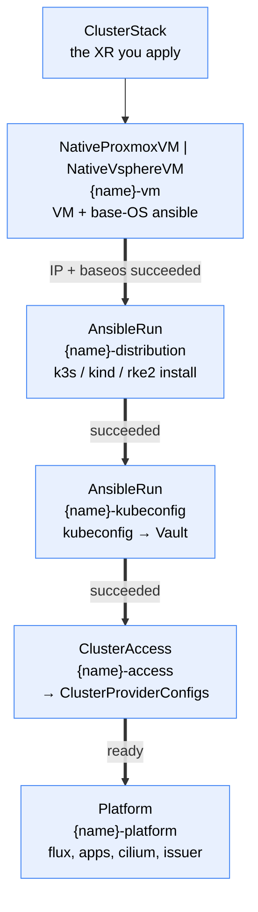

# cluster

A Crossplane v2 Configuration that builds a whole Kubernetes cluster — machine, distribution, access, platform — from a single namespaced `ClusterStack` XR (group `config.stuttgart-things.com`).

## Why

Standing up `u26-kind1` today means hand-writing and hand-correlating **five** XRs across two repos:

| # | Object | File (stuttgart-things/crossplane) |
|---|---|---|
| 1 | `NativeProxmoxVM` (+ baseos) | `xrs/proxmoxvm/labul/kind1/nativeproxmoxvm-u26-kind1.yaml` |
| 2 | `AnsibleRun` — k3s + Cilium | `xrs/ansiblerun/labul/kind1/ansiblerun-k3s-u26-kind1.yaml` |
| 3 | `AnsibleRun` — kubeconfig → Vault | `xrs/ansiblerun/labul/kind1/ansiblerun-kubeconfig-vault-u26-kind1.yaml` |
| 4 | `RemoteCluster` | `xrs/proxmoxvm/labul/kind1/remotecluster-u26-kind1.yaml` |
| 5 | `Platform` | `xrs/proxmoxvm/labul/kind1/platform-u26-kind1.yaml` |

That is ~250 lines in which `u26-kind1` is repeated **8×** and the VM IP `10.31.102.108` **3×** — all by hand, all after the fact, because the IP is only knowable once the VM exists.

The point of this Configuration is **not** less YAML. It is that the IP and the name stop being copy-paste facts:

- the **VM IP** is discovered from the VM child and threaded into both ansible inventories;
- **`clusterName`** becomes the VM name, the guest hostname, the ansible `cluster_name`, the Vault path, the `ClusterAccess` name and `Platform.clusterName`;
- **`platform.cni.enabled`** is derived from the distribution rather than restated.

## Usage

```yaml
apiVersion: config.stuttgart-things.com/v1alpha1
kind: ClusterStack
metadata:
  name: u26-kind1
  namespace: crossplane-system
spec:
  provider: proxmox
  size: medium
  distribution: k3s
  environmentConfig: labul
  platform:
    fluxInit: {enabled: true}
    ipReservation: {enabled: true, createDNS: true}
```

`provider` is the only required field. See [`examples/xr-min.yaml`](examples/xr-min.yaml) (defaults only), [`examples/xr.yaml`](examples/xr.yaml) (reproduces `u26-kind1`), [`examples/xr-max.yaml`](examples/xr-max.yaml) (every field, vSphere + kind).

## What gets created



Everything is a **child XR** — this Configuration never talks to a provider itself. Plus three `Usage` resources for teardown ordering.

| Depth | Resource | Name | From |
|---|---|---|---|
| 0 | `ClusterStack` | *yours* | you |
| 1 | `NativeProxmoxVM` / `NativeVsphereVM` | `{name}-vm` | [proxmoxvm](../../machinery/proxmoxvm/) / [vspherevm](../../machinery/vspherevm/) |
| 1 | `AnsibleRun` ×2 | `{name}-distribution`, `{name}-kubeconfig` | [ansible-run](../../cicd/ansible-run/) |
| 1 | `ClusterAccess` | `{name}-access` | [remote-cluster](../remote-cluster/) |
| 1 | `Platform` | `{name}-platform` | [platform](../platform/) |
| 1 | `Usage` ×3 | `platform-uses-vm`, `platform-uses-access`, `access-uses-vm` | core Crossplane |

## Gates: sticky, and keyed on success

Each stage opens when the previous one **succeeded** — not when it is Ready. An `AnsibleRun` whose PipelineRun failed still reports Ready once its Object is applied; unblocking on that would upload a kubeconfig from a cluster that was never installed.

Every gate is also **sticky**: `(previous succeeded) OR (this child already exists)`. Not emitting a composed resource is what makes Crossplane *delete* it, and bpg / VMware Tools read the VM address from the guest agent — so a momentarily empty value is normal, and without stickiness a blip would delete an `AnsibleRun` whose recreation re-runs the play against a live machine. The `AnsibleRun` children are additionally re-emitted **verbatim** from observed state, because a rebuild during that same blip would rewrite the inventory to an empty IP.

`status.stage` is the single field to look at when a build is stuck:

```console
$ kubectl get clusterstack -n crossplane-system
NAME        READY   STAGE      PROVIDER   DISTRIBUTION   ENDPOINT                     AGE
u26-kind1   true    ready      proxmox    k3s            https://10.31.102.108:6443   40m
```

## Turning the platform layer off

`spec.platformEnabled: false` stops once the cluster is targetable (ClusterAccess ready) — the useful shape for a machine that only needs to exist and be reachable. It is deliberately a **sibling** of `spec.platform` rather than a key inside it: `platform` is a verbatim passthrough of the `Platform` XRD's spec, and a block that preserves unknown fields must not also declare known ones, or schema converters emit `additionalProperties: false` and reject every passthrough key.

## The API endpoint is derived, not copied

When `platform.vaultIssuer` is enabled and `kubernetesHost` is unset, it is injected from `ClusterAccess`'s discovered `status.share.apiEndpoint`. Every `Platform` in the fleet states it by hand today — a literal node IP that goes stale the moment the machine is rebuilt with a new DHCP lease, and nothing notices until an issuer stops working.

An explicit value always wins, so pointing at a VIP or a load balancer stays possible.

This does **not** make the endpoint highly available: it is one node's address, and with multi-node it will be the *first* node's. That is a deliberate interim choice — HA for the control plane's state, not for its reachability — tracked in [#171](https://github.com/stuttgart-things/crossplane-configurations/issues/171) along with the one thing that has to happen early: `--tls-san` is set at **install** time, so a VIP introduced later needs its name in the certificate from the start or every existing cluster needs new certs.

## What you cannot set

- **`platform.cni.enabled`** — derived from the distribution's CNI ownership. k3s installs cilium itself (its config disables flannel and kube-proxy, so the role *must*), and rke2 does the same via `rke2_cni: none` + `install_cilium: true`; kind is built deliberately without one. Setting it by hand is how a cluster ends up with two CNIs. Your other `cni` keys (chart version, values) pass through untouched.
- **`platform.clusterName`** — supplied from `clusterName`.
- **Placement** — node, datastore, bridge, vlan, pool (Proxmox) or the MOIDs (vSphere) live in the per-environment `EnvironmentConfig`. Keeping them out is what makes `provider` a one-word switch rather than a second placement API.

## `clusterName` reaches the cluster itself, not just the resource names

For `distribution: kind` the name is passed as **`kind_cluster_name`**, which is the var `sthings.container.kind` actually reads — `cluster_name` reaches only the upload play, where it is the Vault secret name. Until [#232](https://github.com/stuttgart-things/crossplane-configurations/issues/232) that var was never set, so every kind cluster was built under the play's own default, `dev`, while the `Cni` child aimed cilium at `<clusterName>-control-plane`. That container did not exist, and with `kubeProxyReplacement: true` it deadlocks rather than degrades: nothing programs the `10.96.0.1` VIP until cilium is up, so there is no fallback route to the API. Every node stays `NotReady`, the cilium operator crashloops and its agents sit at `Init:0/6` — with all three ansible stages reporting success, because the failure is only visible inside the target cluster.

The name is set in **both** ansible stages. `upload_kubeconfig_vault` derives `kubeconfig_path` from `kind_cluster_name` too, and before the fix both plays independently defaulted to `dev` and therefore agreed by accident — the upload worked only because the cluster was equally misnamed. Setting it in the distribution stage alone would have broken a working upload.

**Clusters built before v0.2.1 keep the name `dev`.** A completed Tekton `PipelineRun` is immutable, so nothing renames them in place: rebuild the stack, or re-run the distribution stage with `rebuild_kind_cluster` overridden (`rebuild_kind_cluster` is pinned `false` precisely so a reconcile never destroys a live cluster).

## Immutable fields

`provider`, `clusterName`, `distribution` and `size` are rejected on update by CEL. The first three are obvious; `size` is blunt on purpose — a size carries a control-plane node count, and CEL cannot see the catalog to tell a cpu change (in place) from a node-count change (a rebuild). Day-2 scaling is [#172](https://github.com/stuttgart-things/crossplane-configurations/issues/172).

`vm.templateVmId` / `vm.templateUuid` are create-only in the underlying providers: changing either forces delete+recreate rather than a re-clone.

## Deliberate re-runs are per stage

```yaml
runIDs:
  kubeconfig: "2"    # re-runs the upload only
```

Bumping a stage's id suffixes its `PipelineRun` and wrapped Object, which is what makes provider-kubernetes create a *new* run — a completed Tekton `PipelineRun` is immutable and the wrapped Object excludes `Update`, so editing anything else is a **silent no-op** (see [ansible-run](../../cicd/ansible-run/)).

It is a **map, not a single value**, and that is the whole point: one global id renames every stage, so repairing the kubeconfig upload also re-runs the k3s install against a live cluster. That is exactly what the fleet's hand-written XRs warn about in their headers — and exactly what happened on the first live build of this Configuration. A re-run has to name its stage.

The base-OS stage is absent on purpose: it runs from the VM XR's own `spec.ansible`, whose XRD has no re-run knob.

## Cluster preconditions

Beyond the wrapped Configurations' own (see each):

- **Tekton** plus the `ansible-credentials` Secret in the pipeline namespace, and an in-cluster provider-kubernetes config — the ansible stages need them.
- **`provider-kubeconfig`** with a `vault-kubeconfigs` ClusterProviderConfig — see [remote-cluster](../remote-cluster/). That is the **read** side. The **write** side is a Secret in the pipeline namespace, `kubeconfig.vaultSecretName`, defaulting to `vault` — the same name the fleet's sops-git-secrets already materializes, so nothing extra is needed. Until v0.3.1 it defaulted to `vault-kubeconfigs`, matching the ClusterProviderConfig's name but naming a Secret nothing creates; every fresh management cluster failed the upload with `failed to determine alias name from login request` until the alias was made by hand.
- A per-environment **`EnvironmentConfig`** for the chosen provider (`proxmoxvm.…/environment` or `vspherevm.…/environment`) matching `spec.environmentConfig`.

## Verification status

Be precise about what has and has not been proven, because the gaps are where the next surprise lives.

**Proven on a real cluster** (kind1 → Proxmox LabUL, 2026-07-27): the full build chain. One `ClusterStack` produced a VM, ran base-OS provisioning, installed k3s, uploaded the kubeconfig to Vault, and had `ClusterAccess` read it back and emit both ClusterProviderConfigs — `status.ready: true`, endpoint discovered, cluster targetable by name. Deleting the `ClusterStack` removed every resource with no permanent finalizer hangs, and the Proxmox VM was destroyed.

**`distribution: kind` is fixed but NOT yet re-proven.** The first live kind build (kind1 → Proxmox LabUL, 2026-08-10) produced a cluster named `dev` and a deadlocked cilium — [#232](https://github.com/stuttgart-things/crossplane-configurations/issues/232), fixed in v0.2.1 by passing `kind_cluster_name`. The fix is covered by unit tests in the KCL module, not by a live build; until a kind `ClusterStack` reaches `status.ready: true` with `kubectl get nodes` `Ready` on the target, treat the kind path as unverified. The k3s chain below is the one with a live run behind it.

**`distribution: rke2` (new in v0.3.0) is PROVEN as a `ClusterStack`** — u26-kind3 → Proxmox LabUL, 2026-08-12, on v0.3.1. One XR of six lines (`provider`, `size`, `distribution`, `environmentConfig`, `platformEnabled: false`) produced a VM, base-OS'd it, installed rke2, uploaded the kubeconfig to Vault, and had `ClusterAccess` read it back:

```
u26-rke2-1   true   ready   proxmox   rke2   https://10.31.102.191:6443
  status.share: clusterType rke2, serverVersion v1.35.1+rke2r1, cniOwnership self
  ClusterProviderConfigs: u26-rke2-1-kubernetes, u26-rke2-1-helm
  target cluster: u26-rke2-1.labul.sva.de  Ready  control-plane,etcd  v1.35.1+rke2r1
                  cilium + cilium-envoy + cilium-operator Running
```

70 minutes wall clock: ~7 to a base-OS'd VM, ~10 for rke2, ~2 for the upload. Nothing in the XR names the IP or the cluster name twice.

The catalog entry behind it was written only after a separate reference run, as `xplane-cluster-catalog`'s `main.k` demands: on 2026-08-11 an `AnsibleRun` drove `sthings.rke.rke2_cluster` against a VM u26-kind3 had built (VMID 132), producing the same version pair.

**What this run cost, and what it therefore proves about a fresh cluster:** two RBAC grants, both documented in [remote-cluster](../remote-cluster/) §3 and neither previously exercised — `create remoteclusters`, and `patch clusterproviderconfigs.helm.m.crossplane.io` for a dry-run SSA on an *Observe-only* Object. The second is the one to remember, because it fails deceptively: `status.ready` goes **true** and `status.share` fills in, while only Crossplane's own `Ready` condition stays False. A stack can look finished and not be.

**`platformEnabled: true` on rke2 is proven too** — same cluster, same day. Flipping the flag brought the Platform child up in about two minutes: `flux-operator` (chart 0.55.0) installed, the `FluxInstance` reconciled to Flux v2.9.2, the `cert-manager` OCIRepository and Kustomization applied v1.18.1, and cert-manager, cainjector and webhook all Running on the target. `componentCount 2 / readyComponents 2`.

Note what was *not* set: `cni`. On rke2 the ansible role already installed cilium, so the Composition derived `cni.enabled = false` from the catalog's `cniOwnership: self` and composed no `Cni` child — the one field whose hand-setting puts two CNIs on one datapath.

The **kubeconfig stage** for rke2 is proven too, and separately — it is the only thing xplane-cluster 0.4.0 changed in code. On 2026-08-12 an `AnsibleRun` carrying exactly the vars the Composition emits (`kubeconfigStage.vars` + `clusterNameVars` + the new `_serverPaths` lookup) ran against that same VM: the kubeconfig was fetched from `/etc/rancher/rke2/rke2.yaml`, IP-rewritten, stored raw under `kubeconfigs/rke2-reference`, and `kubectl` against it returned the `Ready` node. Three things that a render cannot check — `ansible_become` reaches a 0600 root:root file, and `replace_ip` is **not** a no-op on rke2 (its kubeconfig ships `server: https://127.0.0.1:6443`, so uploading it verbatim would store a kubeconfig no other machine can use, failing much later in `ClusterAccess`).

That run is also what found the `vaultSecretName` default bug fixed in v0.3.1.

Two values in that entry are pinned **against** the play's own defaults, deliberately: `rke2_k8s_version: 1.35.1` and `rke2_release_kind: rke2r1`, where `sthings.rke.rke2_cluster` defaults to 1.36.1 / rke2r2. Every rke2 cluster this fleet runs is on the former pair; shipping the play default would have pinned a combination nobody here has booted — the same trap the k3s entry already records.

**Teardown needs two phases — and with them it is clean.** Deleting a `ClusterStack` that has a Platform child in one step does **not** work: a live run tore the whole tree down in parallel within about three seconds, the `ClusterAccess`'s `RemoteCluster` (owner of the kubeconfig Secret and both ClusterProviderConfigs) went while the Platform's own resources still needed those credentials, and four resources were left behind — a stuck `flux-instance` Object, a `flux-operator` Release that was never deleted at all, and both ClusterProviderConfigs.

The three `Usage` resources that order the children cannot prevent this. They are **composed children of the same XR**, so deleting the `ClusterStack` removes them in the same parallel sweep, and a Usage whose object is gone blocks nothing. They are kept because they do work when a child is deleted on its own; they just cannot order the teardown of their own parent.

**Since v0.3.2 a fourth Usage makes the wrong order impossible rather than silently lossy.** It protects the **composite itself** — `of: ClusterStack/<name>`, `by: Platform/<name>-platform` — and that is what lets it escape the sweep: Crossplane's no-usages webhook matches `apiGroups[*] / resources[*]` on DELETE by the `crossplane.io/in-use` label, so it fires on an XR as readily as on a managed resource, and it fires at **admission**, before Crossplane deletes anything.

```
$ kubectl delete clusterstack u26-rke2-1
Error: admission webhook "nousages.protection.crossplane.io" denied the request:
This resource is in-use by 1 usage(s), including the *v1beta1.Usage
"stack-uses-platform" (in namespace "default") by resource Platform/u26-rke2-1-platform.
```

It is emitted only while the Platform child exists, so `platformEnabled: false` clears it and the delete goes through. It carries `replayDeletion: false`, unlike the other three: replay re-issues a blocked delete once the blocker is gone, which is convenient for a child and dangerous for a whole stack — an abandoned `kubectl delete` would turn a later, unrelated `platformEnabled: false` into a surprise teardown.

**Namespace deletion is the footgun.** The namespace controller issues a DELETE per object, hits the same webhook, and the namespace sits in `Terminating`. True of Usages in general; worse here because the blocked object is the composite. Clear the guard first (`platformEnabled: false`, or delete the Usage) before deleting a namespace that holds a `ClusterStack`.

### The supported procedure

```bash
# Phase 1 — remove only the Platform child. ClusterAccess and the VM stay, so the
# kubeconfig Secret and both ClusterProviderConfigs still exist and the
# Platform's Objects can finalize against a reachable cluster.
kubectl patch clusterstack <name> -n <ns> --type=merge -p '{"spec":{"platformEnabled":false}}'
kubectl wait --for=delete platform/<name>-platform -n <ns> --timeout=5m

# Phase 2 — now delete the stack itself.
kubectl delete clusterstack <name> -n <ns>
```

Since v0.3.2 you cannot get this wrong by accident — skipping phase 1 is rejected, not silently mis-executed.

Verified end to end on a live cluster: phase 1 removed the Platform child and its resources in 50 seconds with nothing wedged, and phase 2 left **zero** leftovers — no Objects, Releases, ClusterProviderConfigs, kubeconfig Secret, RemoteCluster or PipelineRuns, and the Proxmox VM destroyed.

A `ClusterStack` with `platformEnabled: false` from the start tears down cleanly in one step; the two phases are only needed once a Platform child exists.

## Not supported yet

- **Multi-node.** `size: medium-ha` renders an error, by design: no distribution in the catalog declares a verified multi-node path. Tracked as [#170](https://github.com/stuttgart-things/crossplane-configurations/issues/170) (static addressing + aggregate gate) and [#171](https://github.com/stuttgart-things/crossplane-configurations/issues/171) (the API endpoint is a single node IP, so three masters would be HA in name only).
- **Multi-node rke2.** The single-node path exists as of v0.3.0, but the catalog entry declares `multiNode = False` — not a statement about rke2 upstream (the fleet runs multinode rke2 through ansible today), but about this path: a `ClusterStack` composes one VM child, so N masters need N VMs, static addressing and an aggregate ready gate. Same open item as k3s, [#170](https://github.com/stuttgart-things/crossplane-configurations/issues/170).
- **Day-2 scaling** — [#172](https://github.com/stuttgart-things/crossplane-configurations/issues/172).

## Local render

```bash
crossplane render examples/xr.yaml apis/composition.yaml examples/functions.yaml
# or: CONFIG=bootstrap/cluster XR=xr.yaml task render
```

Offline this emits **only the VM child** — every other stage is gated on live status that `render` has none of. That is expected, not a bug. To exercise the chain, pass `--observed-resources` with fake children carrying `status.share.ansibleSucceeded` / `status.succeeded` / `status.ready`.
