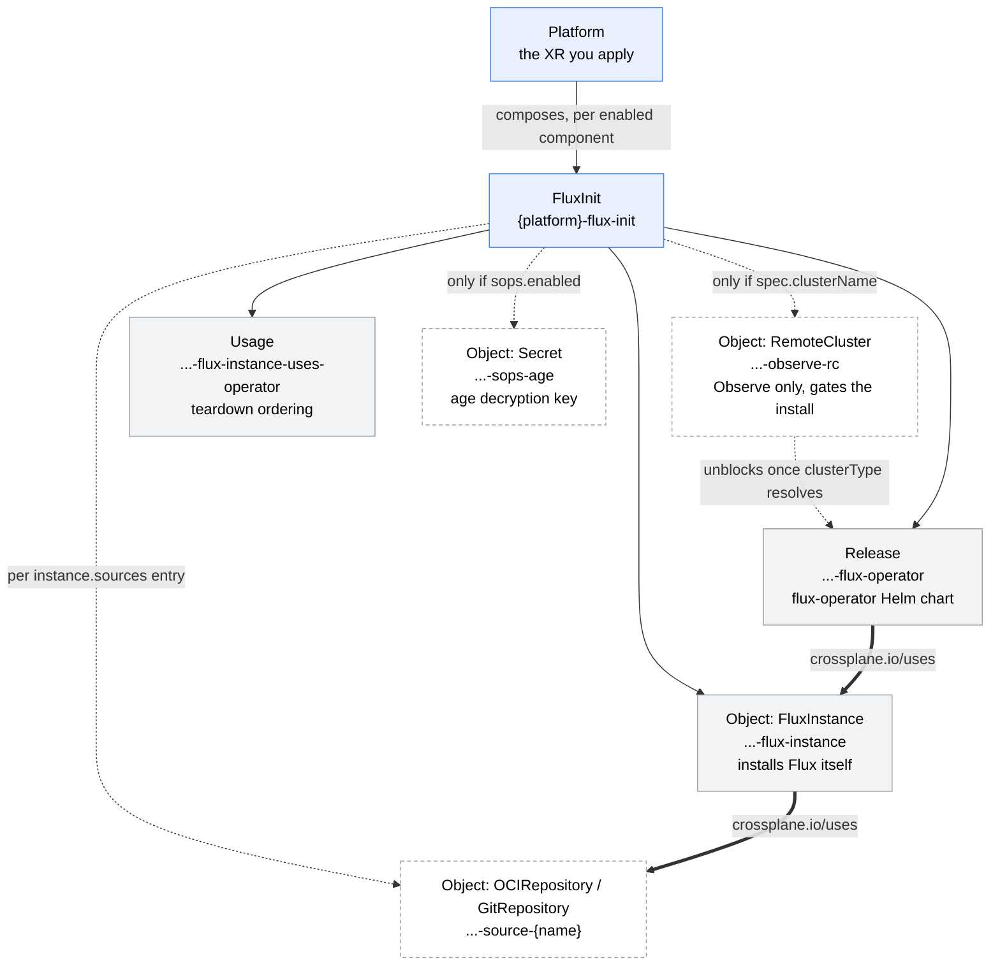

# platform

A Crossplane v2 Configuration that wraps the bootstrap building-block Configurations behind a single namespaced `Platform` XR (group `config.stuttgart-things.com`).

The Composition is a `function-kcl` step that composes one **child XR** per enabled component — today a `FluxInit` (the [flux-init](../flux-init/) Configuration), with further Configurations to follow. The wrapped Configurations stay independently usable; `platform` supplies the shared inputs and aggregates the results.

## Why

Without it, every bootstrap Configuration on a cluster restates the same cluster identity, and there is no single object that answers "is this cluster's platform up, and what was it given?". `Platform` states that once and publishes it back.

## What gets created

A `Platform` composes **child XRs**, not managed resources — the managed resources below are emitted one level deeper, by the wrapped Configuration's own Composition. `platform` itself never talks to a target cluster.



Blue is an XR (Crossplane composes it further), grey a managed resource, dashed-white conditional. Double arrows are ordering (`crossplane.io/uses`): operator → instance → sources.

| Depth | Resource | Name | Emitted by | When |
|---|---|---|---|---|
| 0 | `Platform` | *yours* | you | — |
| 1 | `FluxInit` | `{platform}-flux-init` | **platform** | `spec.fluxInit.enabled` (default `true`) |
| 2 | `kubernetes.m…/Object` → `RemoteCluster` | `{platform}-flux-init-observe-rc` | flux-init | only with `spec.clusterName` |
| 2 | `helm.m…/Release` | `{platform}-flux-init-flux-operator` | flux-init | always |
| 2 | `kubernetes.m…/Object` → `FluxInstance` | `{platform}-flux-init-flux-instance` | flux-init | always |
| 2 | `protection…/Usage` | `{platform}-flux-init-flux-instance-uses-operator` | flux-init | always |
| 2 | `kubernetes.m…/Object` → `OCIRepository`/`GitRepository` | `{platform}-flux-init-source-{source}` | flux-init | per `sources` entry |
| 2 | `kubernetes.m…/Object` → `Secret` | `{platform}-flux-init-sops-age` | flux-init | `sops.enabled` + a key source |

So a minimal `Platform` (no sources, no SOPS, no `clusterName`) composes **four** objects — the `FluxInit` child, and a `Release`, an `Object` and a `Usage` beneath it:

```console
$ crossplane beta trace platform kind1 -n crossplane-system
NAME                                                       SYNCED   READY   STATUS
Platform/kind1 (crossplane-system)                         True     True    Available
└─ FluxInit/kind1-flux-init (crossplane-system)            True     True    Available
   ├─ Release/kind1-flux-init-flux-operator                True     True    Available
   ├─ Object/kind1-flux-init-flux-instance                 True     True    Available
   └─ Usage/kind1-flux-init-flux-instance-uses-operator    -        True    Available
```

With one app enabled (`apps: {dapr: {}}`), verified on kind1 2026-07-18 — note the
source Object and the app Object both come from that single toggle:

```console
$ crossplane beta trace platform kind1 -n crossplane-system
NAME                                                                          SYNCED   READY   STATUS
Platform/kind1 (crossplane-system)                                            True     True    Available
├─ FluxApps/kind1-flux-apps (crossplane-system)                               True     True    Available
│  └─ Object/kind1-flux-apps-app-dapr-control-plane (crossplane-system)       True     True    Available
└─ FluxInit/kind1-flux-init (crossplane-system)                               True     True    Available
   ├─ Release/kind1-flux-init-flux-operator (crossplane-system)               True     True    Available
   ├─ Object/kind1-flux-init-flux-instance (crossplane-system)                True     True    Available
   ├─ Object/kind1-flux-init-source-dapr (crossplane-system)                  True     True    Available
   └─ Usage/kind1-flux-init-flux-instance-uses-operator (crossplane-system)   -        True    Available
```

## Teardown ordering

Delete the `Platform` and Crossplane removes the children in parallel, which can
race: if the `FluxInstance` goes before the source Objects, Flux's CRDs are gone
and provider-kubernetes can no longer observe an `OCIRepository` to finalize it,
so those Objects hang on `finalizer.managedresource.crossplane.io` with

```
observe failed: cannot get object: no matches for kind "OCIRepository" in version "source.toolkit.fluxcd.io/v1"
```

Seen on kind1 while migrating a hand-built stack. Clear it with
`kubectl patch object.kubernetes.m.crossplane.io <name> -n <ns> --type=merge -p '{"metadata":{"finalizers":[]}}'`
— the underlying resource is already gone with the CRD. When tearing down by
hand, delete `FluxApps` first (so Kustomizations prune while Flux still runs),
then `FluxInit`.

On the target cluster that becomes the flux-operator Deployment plus the Flux controllers the `FluxInstance` installs.

## Versions

| What | Version | Where it comes from |
|---|---|---|
| `platform` Configuration | `v0.2.0` | [`crossplane.yaml`](crossplane.yaml) |
| `xplane-platform` KCL module | `0.1.0` | [`apis/composition.yaml`](apis/composition.yaml) (OCI, pulled at render time) |
| `xplane-flux-catalog` KCL module | `0.1.1` | dependency of `xplane-platform` — the app definitions |
| Crossplane | `>=v2.1.3` | `crossplane.yaml` |
| `flux-init` Configuration | `>=v0.2.0` | `dependsOn` — pulled automatically |
| `xplane-flux-init` KCL module | `0.2.0` | flux-init's Composition (OCI, pulled at render time) |
| provider-helm | `>=v1.0.0,<v2.0.0` | `dependsOn` |
| provider-kubernetes | `>=v1.2.0,<v2.0.0` | `dependsOn` |
| function-kcl | `>=v0.12.0,<v0.13.0` | `dependsOn` |
| function-environment-configs | `>=v0.7.0,<v0.8.0` | `dependsOn` |
| function-auto-ready | `>=v0.6.5,<v0.7.0` | `dependsOn` — **not** `v0.7.x` |
| flux-operator chart | `0.55.0` | `flux-defaults` EnvironmentConfig · override with `spec.fluxInit.operatorChart.version` |
| Flux distribution | `2.x` | `flux-defaults` EnvironmentConfig · override with `spec.fluxInit.instance.distribution` |

The two bottom rows are the only versions an XR normally sets; everything else is a package pin. `>=v0.2.0` on `flux-init` is a floor, not a cap — `clusterName` targeting needs it.

## The shared contract

`status.shared` is the point of this Configuration. The cluster identity is stated **once** on `spec`, resolved by the Composition, injected into every child XR, and published on `status.shared`:

| Field | Source |
|---|---|
| `clusterName` | `spec.clusterName` |
| `helmProviderConfigRef` | `spec.helmProviderConfigRef`, else derived `{clusterName}-helm` |
| `kubernetesProviderConfigRef` | `spec.kubernetesProviderConfigRef`, else derived `{clusterName}-kubernetes` |
| `observeProviderConfigRef` | `spec.observeProviderConfigRef` (default `in-cluster`) |
| `namespace` | `spec.namespace` (default `flux-system`) |
| `clusterType` | **discovered** — lifted up from the `FluxInit` child, which reads it off the target `RemoteCluster` |

`clusterType` is the shape that matters as components are added: a fact discovered by one child, published once, consumed by the next — instead of each component re-observing the `RemoteCluster` itself.

Fields that have not resolved are **omitted**, not published as `""` — `clusterName` on the explicit-refs path, and `clusterType` until the `FluxInit` child has observed the `RemoteCluster` (which it only does when `clusterName` is set). So `if status.shared.clusterType` is a safe test for "discovered", and a consumer never reads a value that was never resolved.

`status.components` carries per-component readiness and outputs; `status.ready` is true when every **enabled** component is Ready (vacuously true when none are enabled, matching what `function-auto-ready` reports on the `Ready` condition).

```yaml
status:
  shared:
    clusterName: staging
    helmProviderConfigRef: staging-helm
    kubernetesProviderConfigRef: staging-kubernetes
    observeProviderConfigRef: in-cluster
    namespace: flux-system
    clusterType: k3s
  components:
    fluxInit:
      enabled: true
      ready: true
      operatorReady: true
      instanceReady: true
      sourcesReady: true
      sourceCount: 1
    fluxApps:
      enabled: true
      ready: true
      appCount: 1
      readyCount: 1
  componentCount: 2
  readyComponents: 2
  ready: true
```

## Usage

One `clusterName` is the whole shared contract — the provider config refs derive from it and every component inherits it:

```yaml
apiVersion: config.stuttgart-things.com/v1alpha1
kind: Platform
metadata:
  name: staging
  namespace: crossplane-system
spec:
  clusterName: staging
  fluxInit:
    enabled: true
    instance:
      sources:
        - name: fleet-infra
          kind: OCIRepository
          url: oci://ghcr.io/stuttgart-things/fleet-infra
          ref: latest
          path: clusters/staging
```

See [`examples/`](examples/): `xr-min.yaml` (defaults only), `xr.yaml` (the copy-paste template), `xr-max.yaml` (every field).

## Components

| Component | `spec` block | Child XR | Configuration |
|---|---|---|---|
| Flux bootstrap | `spec.fluxInit` | `FluxInit` | [flux-init](../flux-init/) |
| Apps | `spec.apps` | `FluxApps` | [flux-apps](../flux-apps/) |

Each component block mirrors the child XR's own spec (minus the shared identity, which is injected) and is passed through verbatim — `operatorChart`, `instance`, `kustomize` and `sops` all reach `FluxInit` unchanged. `enabled: false` omits the child entirely.

## Apps

`spec.apps` is the reason the umbrella earns its keep. stuttgart-things/flux publishes **one OCI artifact per app**, so a Flux source name and an app are the same fact — deploying one by hand means adding an `OCIRepository` to a `FluxInit` **and** referencing it by name in a `FluxApps`, two objects joined by a string nothing validates until a Kustomization stalls.

Naming an app emits both:

```yaml
spec:
  clusterName: kind1
  apps:
    dapr: {}
```

| Emitted on | What |
|---|---|
| `FluxInit` child | `instance.sources: [{name: dapr, kind: OCIRepository, url: oci://…/flux/apps/dapr, ref: v1.18.1}]` |
| `FluxApps` child | `dapr-control-plane` + `dapr-template-execution`, each `sourceRef: {kind: OCIRepository, name: dapr}`, with `dependsOn` rewritten to the emitted names and `timeout: 15m` on the chart-installing one |

App definitions come from the [`xplane-flux-catalog`](https://github.com/stuttgart-things/kcl/tree/main/crossplane/xplane-flux-catalog) KCL module, which holds **structural facts only** — artifact URL, component paths, ordering, timeouts. Substitution *values* are environment-specific and belong on the XR (below), not in the catalog, which would otherwise drift from each app's README in stuttgart-things/flux.

### Overrides

```yaml
apps:
  dapr:
    version: v1.17.0                             # else the catalog's defaultVersion
    substitute: {DAPR_NAMESPACE: dapr-system}    # applied to every component
    components:
      control-plane: {enabled: false}
      template-execution:
        substitute: {FLUX_SOURCE_API_VERSION: v1}   # merged over app-level, wins
        substituteFrom:
          - kind: Secret
            name: dapr-backstage-template-execution-vars
```

`substituteFrom` is **component-scoped on purpose**: it resolves at *build* time and a missing Secret fails the build, so an app-level one would break components that do not need it.

### Rules

| Rule | Where |
|---|---|
| apps enabled while `fluxInit.enabled: false` | rejected by a **CEL rule at apply time** — fluxInit creates the sources apps reference |
| a component depending on a **disabled** sibling | rejected at render, naming the offenders — it would otherwise sit in `DependencyNotReady` forever |
| unknown app name | rejected by the catalog |
| `enabled: false` | **prunes** — the entry stops being emitted, and flux-apps' Objects use `managementPolicies: ["*"]`, so the Kustomization and its workload are removed |

## Adding a component

1. Add a `spec.<component>` block to [`apis/definition.yaml`](apis/definition.yaml) (with `enabled`, default `true`) and a `status.components.<component>` block.
2. In [`apis/composition.yaml`](apis/composition.yaml), emit the child XR under an `if _<component>Enabled:` guard, injecting the shared refs; read its status back out of `ocds` and add its readiness to `_enabledReady`.
3. Add the wrapped Configuration to `dependsOn` in [`crossplane.yaml`](crossplane.yaml).

If a component needs a value another component discovers, put it on `status.shared` (as `clusterType` does) rather than re-deriving it.

### Component schemas are mirrored, and must be kept in lockstep

`spec.fluxInit.operatorChart` and `spec.fluxInit.instance` are **typed copies** of the corresponding blocks in flux-init's XRD (`kustomize` and `sops` are `x-kubernetes-preserve-unknown-fields` passthroughs instead, because their shape is FluxInstance's, not ours). A field added to flux-init is therefore not usable through `Platform` until it is mirrored here.

That failure is loud, not silent — worth knowing which error you are looking at:

| How you apply it | Result |
|---|---|
| `kubectl apply` (default, strict) | rejected: `unknown field "spec.fluxInit.instance.<x>"` |
| server-side apply (Flux, Argo CD) | rejected: `field not declared in schema` |
| `kubectl apply --validate=ignore` | **silently pruned** — the field never reaches the child |

Mirroring the field into [`apis/definition.yaml`](apis/definition.yaml) is the fix; the Composition passes `instance` through verbatim, so no KCL change is needed. Do not "solve" this by making `instance` preserve-unknown: the field would then reach the child `FluxInit`, whose own schema rejects it when Crossplane server-side-applies it — turning a clear rejection on the object you wrote into a composition error one level down.

## Cluster preconditions

Apply [`examples/rbac.yaml`](examples/rbac.yaml) **once per cluster** — it is the complete grant for every flux component this umbrella composes (flux-init's `FluxInstance` + sources, flux-apps' `Kustomization`s), and it is required every time you use `platform` or `flux-init` against an in-cluster provider config.

It cannot be self-contained in a Composition, unlike the namespace precondition: `provider-kubernetes` has no `create` on `clusterroles`/`clusterrolebindings` and no `escalate` or `bind` verb, so a composed Object that tried to create the grant is denied. It must come from the layer that installs Crossplane. The file also pins the provider's ServiceAccount name via a `DeploymentRuntimeConfig` — by default that name carries the package-revision hash, which changes on provider upgrade and would silently break a binding pinned to it.

Beyond that, the preconditions are those of the wrapped Configurations — `platform` adds none of its own:

- A Helm `ClusterProviderConfig` (`helm.m.crossplane.io/v1beta1`) named `{clusterName}-helm`, or whatever `spec.helmProviderConfigRef` says.
- A Kubernetes `ClusterProviderConfig` (`kubernetes.m.crossplane.io/v1alpha1`) named `{clusterName}-kubernetes`.
- A `flux-defaults` EnvironmentConfig — consumed by the flux-init Composition, not by this one. See [`../flux-init/examples/environment-config.yaml`](../flux-init/examples/environment-config.yaml).

## Notes

- The XR kind is `Platform`, not `Workspace`: `provider-opentofu` already serves `kind: Workspace` (`opentofu.m.upbound.io`) on these clusters, so a second `workspaces` plural would make `kubectl get workspaces` ambiguous.
- `crossplane render` on a `Platform` renders the child XRs but **not** their compositions — it stops at the `FluxInit` object. To check what Flux itself will emit, render [`../flux-init`](../flux-init/) with the child XR.
