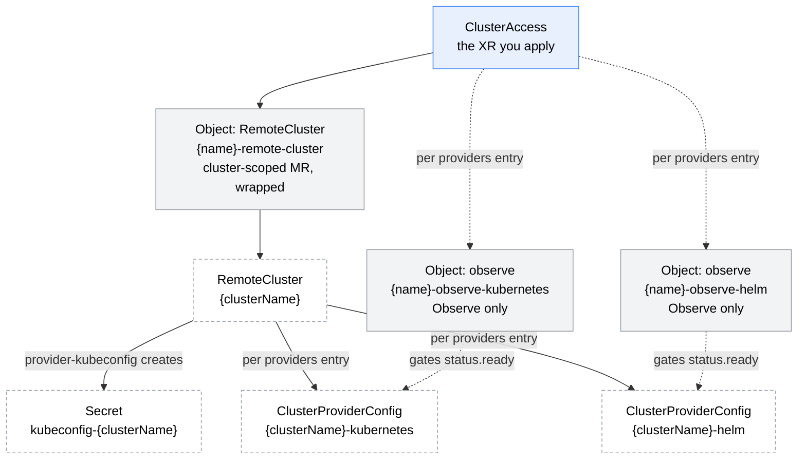

# remote-cluster

A Crossplane v2 Configuration that turns *"a kubeconfig exists in Vault"* into *"Crossplane can target this cluster by name"*, from a namespaced `ClusterAccess` XR (group `config.stuttgart-things.com`).

## Why

Two problems, both of them duplication.

**The naming convention had no owner.** `{clusterName}-kubernetes` / `{clusterName}-helm` is currently restated in three places: as an XRD default in [platform](../platform/), again in [flux-init](../flux-init/), and by hand in every `RemoteCluster` manifest in the fleet repo. Change the rule and you have to find all three.

**Nothing published readiness.** `flux-init` and `cni` each emit their own private `{name}-observe-rc` Object to wait for the target cluster, reimplementing the same wait. There was no object to ask *"is this cluster targetable yet?"*.

A third thing falls out for free: the `RemoteCluster` already discovers a lot about the target — API endpoint, distribution, server version, CIDRs — and none of it was surfaced. `status.share.apiEndpoint` is exactly the value a `Platform`'s `vaultIssuer.kubernetesHost` restates as a hand-copied node IP today.

## What gets created



| Resource | Name | When |
|---|---|---|
| `kubernetes.m…/Object` → `RemoteCluster` | `{name}-remote-cluster` | always |
| `kubernetes.m…/Object` (Observe) → `ClusterProviderConfig` | `{name}-observe-{provider}` | per `spec.providers` entry |

The `Secret` and the `ClusterProviderConfig`s are created by **provider-kubeconfig**, not by this Composition — it only asks for them and then watches for them.

### Why the RemoteCluster is wrapped

`RemoteCluster` is **cluster-scoped** and `ClusterAccess` is namespaced. A namespaced composite cannot compose a cluster-scoped managed resource in Crossplane v2, so it goes inside a namespaced `kubernetes.m.crossplane.io/v1alpha1` Object applied through the `in-cluster` provider config — the same wrapping pattern the rest of this repo uses. This sidesteps the scope question rather than betting on it.

### Why the Observe stubs

Without them `status.ready` would mean "the RemoteCluster reconciled", and a downstream stage would start targeting `{clusterName}-helm` before it exists. With them it means "the configs are there". They are `managementPolicies: [Observe]` — they never create or delete anything.

## Usage

```yaml
apiVersion: config.stuttgart-things.com/v1alpha1
kind: ClusterAccess
metadata:
  name: u26-kind1
  namespace: crossplane-system
spec:
  clusterName: u26-kind1
```

That is the whole thing. `source.path` defaults to `clusterName` (the convention `sthings.container.upload_kubeconfig_vault` writes with), `source.key` to `kubeconfig`, and `providers` to `[kubernetes, helm]`.

See [`examples/xr-min.yaml`](examples/xr-min.yaml) (defaults only), [`examples/xr.yaml`](examples/xr.yaml) (the realistic case), [`examples/xr-max.yaml`](examples/xr-max.yaml) (every field, deliberately non-default).

## Status

```console
$ kubectl get clusteraccess -n crossplane-system
NAME        READY   ENDPOINT                     TYPE   AGE
u26-kind1   true    https://10.31.102.108:6443   k3s    2m
```

`status.share` republishes what the target cluster reported about itself: `apiEndpoint`, `clusterType`, `serverVersion`, `nodeCount`, `podCIDR`, `serviceCIDR`, `internalNetworkKey`, `secretRef`. These are **discovered facts, not declarations** — they are published even while `status.ready` is still false, because a consumer may legitimately want the endpoint before the Helm config exists.

## Cluster preconditions

Not part of the package — see [`examples/cluster-provider-config.yaml`](examples/cluster-provider-config.yaml) for shapes.

1. **`provider-kubeconfig`** installed, plus a `ClusterProviderConfig` matching `spec.kubeconfigProviderConfigRef` (default `vault-kubeconfigs`) carrying the Vault address, the AppRole and the CA trust. In the fleet this comes from the `provider-kubeconfig-vault` chart (`stuttgart-things/crossplane`, `platform/baseline/provider-kubeconfig-vault`), which also grants the downstream RBAC the provider needs to create ClusterProviderConfigs.
2. **An in-cluster `ClusterProviderConfig`** (`kubernetes.m`, InjectedIdentity) named per `spec.kubernetesProviderConfigRef` (default `in-cluster`).
3. **The kubeconfig in Vault must be raw YAML.** provider-kubeconfig hands the value straight to `clientcmd.RESTConfigFromKubeConfig` and never base64-decodes it — which is why the fleet uploads it with the container collection's `upload_kubeconfig_vault` play and not the rke one, which base64-encodes.

## Local render

```bash
crossplane render examples/xr.yaml apis/composition.yaml examples/functions.yaml
# or: CONFIG=bootstrap/remote-cluster XR=xr.yaml task render
```

No `--extra-resources` needed (this Configuration uses no EnvironmentConfig). To exercise the status step, pass `--observed-resources` with a fake `Object` whose `status.atProvider.manifest` mirrors a live `RemoteCluster`.

## Files

```
bootstrap/remote-cluster/
├── crossplane.yaml
├── README.md
├── apis/
│   ├── definition.yaml       # XRD — ClusterAccess, namespaced
│   └── composition.yaml      # inline function-kcl: render + patch-status
└── examples/
    ├── xr-min.yaml
    ├── xr.yaml
    ├── xr-max.yaml
    ├── cluster-provider-config.yaml
    ├── configuration.yaml
    └── functions.yaml
```
