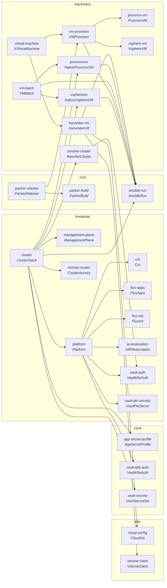

<!-- GENERATED FILE — do not edit by hand.
     Regenerate with: python3 tests/lint/lint-configurations.py --write
     The generator is check_diagrams() in tests/lint/lint-configurations.py. -->

# XR ownership

Which Configuration brings which along, and what each one's XR is.
Derived from the repo, not maintained beside it: every number and every
edge below is parsed out of `*/crossplane.yaml`, `apis/definition.yaml`
and `apis/composition.yaml` at generation time. A stale copy fails the
lint rather than quietly misinforming — see *How this stays true* at the
bottom.

## The chain

`A --> B` reads *A's package declares B in `dependsOn`*, so installing A
installs B. Only edges inside this repo are drawn; providers and
functions are listed per Configuration further down.



Not in the graph (9): `argocd-cluster`, `capability`, `cilium`, `cluster-backup`, `minio`, `namespace`, `scheduled-run`, `tofu-run`, `vault-config` — neither depends on a Configuration of this repo nor is depended on by one.

Entry points (nothing in this repo depends on them): `cluster`, `packer-release`, `virtual-machine`, `vm-batch`.

## What each one is

| category | Configuration | XR kind | group | scope | version | brings along |
|---|---|---|---|---|---|---|
| bootstrap | [argocd-cluster](../../bootstrap/argocd-cluster/) | `ArgocdCluster` | `config.stuttgart-things.com` | Namespaced | v0.2.1 | — |
| bootstrap | [capability](../../bootstrap/capability/) | `Capability` | `config.stuttgart-things.com` | Namespaced | v0.7.2 | — |
| bootstrap | [cilium](../../bootstrap/cilium/) | `Cilium` | `config.stuttgart-things.com` | Namespaced | v0.1.0 | — |
| bootstrap | [cluster](../../bootstrap/cluster/) | `ClusterStack` | `config.stuttgart-things.com` | Namespaced | v0.11.10 | `ansible-run`, `app-secret-profile`, `management-plane`, `platform`, `proxmoxvm`, `rancher-cluster`, `remote-cluster`, `vault-secrets`, `vspherevm` |
| bootstrap | [cni](../../bootstrap/cni/) | `Cni` | `config.stuttgart-things.com` | Namespaced | v0.1.4 | — |
| bootstrap | [flux-apps](../../bootstrap/flux-apps/) | `FluxApps` | `config.stuttgart-things.com` | Namespaced | v0.1.4 | — |
| bootstrap | [flux-init](../../bootstrap/flux-init/) | `FluxInit` | `config.stuttgart-things.com` | Namespaced | v0.3.0 | — |
| bootstrap | [ip-reservation](../../bootstrap/ip-reservation/) | `XIPReservation` | `resources.stuttgart-things.com` | Namespaced | v0.1.0 | — |
| bootstrap | [management-plane](../../bootstrap/management-plane/) | `ManagementPlane` | `config.stuttgart-things.com` | Namespaced | v0.3.3 | — |
| bootstrap | [platform](../../bootstrap/platform/) | `Platform` | `config.stuttgart-things.com` | Namespaced | v0.8.0 | `cni`, `flux-apps`, `flux-init`, `ip-reservation`, `vault-auth`, `vault-k8s-auth`, `vault-pki-secrets` |
| bootstrap | [remote-cluster](../../bootstrap/remote-cluster/) | `ClusterAccess` | `config.stuttgart-things.com` | Namespaced | v0.1.1 | — |
| bootstrap | [vault-auth](../../bootstrap/vault-auth/) | `VaultK8sAuth` | `config.stuttgart-things.com` | Namespaced | v0.4.0 | — |
| bootstrap | [vault-config](../../bootstrap/vault-config/) | `VaultConfig` | `config.stuttgart-things.com` | Namespaced | v0.1.0 | — |
| bootstrap | [vault-pki-secrets](../../bootstrap/vault-pki-secrets/) | `VaultPkiSecret` | `config.stuttgart-things.com` | Namespaced | v0.1.5 | — |
| cicd | [ansible-run](../../cicd/ansible-run/) | `AnsibleRun` | `resources.stuttgart-things.com` | Namespaced | v0.3.2 | — |
| cicd | [cluster-backup](../../cicd/cluster-backup/) | `ClusterBackup` | `resources.stuttgart-things.com` | Namespaced | v0.2.0 | — |
| cicd | [packer-build](../../cicd/packer-build/) | `PackerBuild` | `resources.stuttgart-things.com` | Namespaced | v0.4.1 | — |
| cicd | [packer-release](../../cicd/packer-release/) | `PackerRelease` | `resources.stuttgart-things.com` | Namespaced | v0.4.2 | `packer-build`, `vm-provision` |
| cicd | [scheduled-run](../../cicd/scheduled-run/) | `ScheduledRun` | `resources.stuttgart-things.com` | Namespaced | v0.1.1 | — |
| cicd | [tofu-run](../../cicd/tofu-run/) | `TofuRun` | `resources.stuttgart-things.com` | Namespaced | v0.1.0 | — |
| k8s | [cloud-config](../../k8s/cloud-config/) | `CloudInit` | `resources.stuttgart-things.com` | Namespaced | v0.5.5 | — |
| k8s | [namespace](../../k8s/namespace/) | `ManagedNamespace` | `resources.stuttgart-things.com` | Namespaced | v0.1.2 | — |
| k8s | [volume-claim](../../k8s/volume-claim/) | `VolumeClaim` | `resources.stuttgart-things.com` | Namespaced | v0.1.0 | — |
| machinery | [harvester-vm](../../machinery/harvester-vm/) | `HarvesterVM` | `resources.stuttgart-things.com` | Namespaced | v0.1.12 | `ansible-run`, `cloud-config`, `volume-claim` |
| machinery | [proxmox-vm](../../machinery/proxmox-vm/) | `ProxmoxVM` | `resources.stuttgart-things.com` | Namespaced | v0.2.0 | — |
| machinery | [proxmoxvm](../../machinery/proxmoxvm/) | `NativeProxmoxVM` | `resources.stuttgart-things.com` | Namespaced | v0.16.0 | `ansible-run` |
| machinery | [rancher-cluster](../../machinery/rancher-cluster/) | `RancherCluster` | `resources.stuttgart-things.com` | Namespaced | v0.9.0 | `vault-auth` |
| machinery | [virtual-machine](../../machinery/virtual-machine/) | `XVirtualMachine` | `resources.stuttgart-things.com` | Namespaced | v0.1.14 | `harvester-vm`, `vm-provision` |
| machinery | [vm-batch](../../machinery/vm-batch/) | `VMBatch` | `resources.stuttgart-things.com` | Namespaced | v0.1.3 | `ansible-run`, `proxmoxvm`, `vspherevm` |
| machinery | [vm-provision](../../machinery/vm-provision/) | `VMProvision` | `resources.stuttgart-things.com` | Namespaced | v0.1.2 | `ansible-run`, `proxmox-vm`, `vsphere-vm` |
| machinery | [vsphere-vm](../../machinery/vsphere-vm/) | `VsphereVM` | `resources.stuttgart-things.com` | Namespaced | v0.1.0 | — |
| machinery | [vspherevm](../../machinery/vspherevm/) | `NativeVsphereVM` | `resources.stuttgart-things.com` | Namespaced | v0.12.0 | `ansible-run` |
| storage | [minio](../../storage/minio/) | `MinioBucket` | `storage.stuttgart-things.com` | Cluster | v0.1.0 | — |
| vault | [app-secret-profile](../../vault/app-secret-profile/) | `AppSecretProfile` | `secrets.stuttgart-things.com` | Cluster | v0.1.1 | — |
| vault | [vault-k8s-auth](../../vault/vault-k8s-auth/) | `VaultK8sAuth` | `vault.stuttgart-things.com` | Namespaced | v0.4.2 | — |
| vault | [vault-secrets](../../vault/vault-secrets/) | `VaultSecretSet` | `vault.stuttgart-things.com` | Namespaced | v0.4.0 | — |

## Where each Composition's body lives

A pipeline step whose `source` is an `oci://` reference has its logic in
a KCL module, not in this repo. That is the boundary of what these
diagrams can see.

| Configuration | pipeline | module pins |
|---|---|---|
| `argocd-cluster` | kcl → kcl → auto-ready | inline |
| `capability` | kcl → auto-ready | `oci://ghcr.io/stuttgart-things/xplane-capability?tag=0.8.2` |
| `cilium` | kcl → kcl → auto-ready | inline |
| `cluster` | environment-configs → kcl → auto-ready | `oci://ghcr.io/stuttgart-things/xplane-cluster?tag=0.20.0` |
| `cni` | kcl → auto-ready | `oci://ghcr.io/stuttgart-things/xplane-cni?tag=0.3.1` |
| `flux-apps` | environment-configs → kcl → auto-ready | `oci://ghcr.io/stuttgart-things/xplane-flux-apps?tag=0.3.0` |
| `flux-init` | environment-configs → kcl → auto-ready | `oci://ghcr.io/stuttgart-things/xplane-flux-init?tag=0.3.0` |
| `ip-reservation` | kcl → auto-ready | `oci://ghcr.io/stuttgart-things/xplane-ip-reservation?tag=0.1.0` |
| `management-plane` | kcl → auto-ready | `oci://ghcr.io/stuttgart-things/xplane-management-plane?tag=0.6.1` |
| `platform` | kcl → auto-ready | `oci://ghcr.io/stuttgart-things/xplane-platform?tag=0.25.0` |
| `remote-cluster` | kcl → kcl → auto-ready | inline |
| `vault-auth` | kcl → auto-ready | `oci://ghcr.io/stuttgart-things/xplane-vault-auth?tag=0.9.0` |
| `vault-config` | kcl → auto-ready | `oci://ghcr.io/stuttgart-things/xplane-vault-config?tag=0.5.0` |
| `vault-pki-secrets` | environment-configs → go-templating → auto-ready | inline |
| `ansible-run` | environment-configs → kcl → kcl → auto-ready | `oci://ghcr.io/stuttgart-things/kcl-tekton-pr?tag=0.15.1` |
| `cluster-backup` | environment-configs → kcl → kcl → auto-ready | inline |
| `packer-build` | environment-configs → kcl → kcl → auto-ready | `oci://ghcr.io/stuttgart-things/kcl-tekton-pr-packer?tag=0.6.1` |
| `packer-release` | environment-configs → kcl → kcl → auto-ready | inline |
| `scheduled-run` | environment-configs → kcl → kcl → auto-ready | inline |
| `tofu-run` | environment-configs → kcl → kcl → auto-ready | `oci://ghcr.io/stuttgart-things/kcl-tofu-pr?tag=0.1.0` |
| `cloud-config` | go-templating → auto-ready | inline |
| `namespace` | go-templating → auto-ready | inline |
| `volume-claim` | go-templating → auto-ready | inline |
| `harvester-vm` | environment-configs → patch-and-transform → patch-and-transform → go-templating → auto-ready | inline |
| `proxmox-vm` | environment-configs → patch-and-transform | inline |
| `proxmoxvm` | environment-configs → kcl → kcl → auto-ready | inline |
| `rancher-cluster` | environment-configs → go-templating → auto-ready | inline |
| `virtual-machine` | environment-configs → kcl → kcl → auto-ready | inline |
| `vm-batch` | kcl → kcl → auto-ready | inline |
| `vm-provision` | kcl → kcl → auto-ready | inline |
| `vsphere-vm` | environment-configs → patch-and-transform | inline |
| `vspherevm` | environment-configs → kcl → kcl → auto-ready | inline |
| `minio` | go-templating → auto-ready | inline |
| `app-secret-profile` | go-templating | inline |
| `vault-k8s-auth` | go-templating → auto-ready | inline |
| `vault-secrets` | go-templating → auto-ready | inline |

## Providers and functions each one requires

| Configuration | dependsOn (outside this repo) |
|---|---|
| `argocd-cluster` | `xpkg.crossplane.io/crossplane-contrib/function-auto-ready`<br/>`xpkg.crossplane.io/crossplane-contrib/function-kcl`<br/>`xpkg.crossplane.io/crossplane-contrib/provider-kubernetes` |
| `capability` | `xpkg.crossplane.io/crossplane-contrib/function-auto-ready`<br/>`xpkg.crossplane.io/crossplane-contrib/function-kcl`<br/>`xpkg.crossplane.io/crossplane-contrib/provider-kubernetes` |
| `cilium` | `xpkg.crossplane.io/crossplane-contrib/function-auto-ready`<br/>`xpkg.crossplane.io/crossplane-contrib/function-kcl`<br/>`xpkg.crossplane.io/crossplane-contrib/provider-helm`<br/>`xpkg.crossplane.io/crossplane-contrib/provider-kubernetes` |
| `cluster` | `xpkg.crossplane.io/crossplane-contrib/function-auto-ready`<br/>`xpkg.crossplane.io/crossplane-contrib/function-environment-configs`<br/>`xpkg.crossplane.io/crossplane-contrib/function-kcl`<br/>`xpkg.upbound.io/upbound/provider-opentofu` |
| `cni` | `xpkg.crossplane.io/crossplane-contrib/function-auto-ready`<br/>`xpkg.crossplane.io/crossplane-contrib/function-kcl`<br/>`xpkg.crossplane.io/crossplane-contrib/provider-helm`<br/>`xpkg.crossplane.io/crossplane-contrib/provider-kubernetes` |
| `flux-apps` | `xpkg.crossplane.io/crossplane-contrib/function-auto-ready`<br/>`xpkg.crossplane.io/crossplane-contrib/function-environment-configs`<br/>`xpkg.crossplane.io/crossplane-contrib/function-kcl`<br/>`xpkg.crossplane.io/crossplane-contrib/provider-kubernetes` |
| `flux-init` | `xpkg.crossplane.io/crossplane-contrib/function-auto-ready`<br/>`xpkg.crossplane.io/crossplane-contrib/function-environment-configs`<br/>`xpkg.crossplane.io/crossplane-contrib/function-kcl`<br/>`xpkg.crossplane.io/crossplane-contrib/provider-helm`<br/>`xpkg.crossplane.io/crossplane-contrib/provider-kubernetes` |
| `ip-reservation` | `xpkg.crossplane.io/crossplane-contrib/function-auto-ready`<br/>`xpkg.crossplane.io/crossplane-contrib/function-kcl`<br/>`xpkg.crossplane.io/crossplane-contrib/provider-kubernetes` |
| `management-plane` | `xpkg.crossplane.io/crossplane-contrib/function-auto-ready`<br/>`xpkg.crossplane.io/crossplane-contrib/function-kcl`<br/>`xpkg.crossplane.io/crossplane-contrib/provider-helm`<br/>`xpkg.crossplane.io/crossplane-contrib/provider-kubernetes` |
| `platform` | `xpkg.crossplane.io/crossplane-contrib/function-auto-ready`<br/>`xpkg.crossplane.io/crossplane-contrib/function-environment-configs`<br/>`xpkg.crossplane.io/crossplane-contrib/function-go-templating`<br/>`xpkg.crossplane.io/crossplane-contrib/function-kcl`<br/>`xpkg.crossplane.io/crossplane-contrib/provider-helm`<br/>`xpkg.crossplane.io/crossplane-contrib/provider-kubernetes`<br/>`xpkg.upbound.io/upbound/provider-opentofu` |
| `remote-cluster` | `xpkg.crossplane.io/crossplane-contrib/function-auto-ready`<br/>`xpkg.crossplane.io/crossplane-contrib/function-kcl`<br/>`xpkg.crossplane.io/crossplane-contrib/provider-kubernetes` |
| `vault-auth` | `xpkg.crossplane.io/crossplane-contrib/function-auto-ready`<br/>`xpkg.crossplane.io/crossplane-contrib/function-kcl`<br/>`xpkg.upbound.io/upbound/provider-opentofu` |
| `vault-config` | `xpkg.crossplane.io/crossplane-contrib/function-auto-ready`<br/>`xpkg.crossplane.io/crossplane-contrib/function-kcl`<br/>`xpkg.crossplane.io/crossplane-contrib/provider-helm`<br/>`xpkg.crossplane.io/crossplane-contrib/provider-kubernetes` |
| `vault-pki-secrets` | `xpkg.crossplane.io/crossplane-contrib/function-auto-ready`<br/>`xpkg.crossplane.io/crossplane-contrib/function-environment-configs`<br/>`xpkg.crossplane.io/crossplane-contrib/function-go-templating`<br/>`xpkg.crossplane.io/crossplane-contrib/provider-kubernetes` |
| `ansible-run` | `xpkg.crossplane.io/crossplane-contrib/function-auto-ready`<br/>`xpkg.crossplane.io/crossplane-contrib/function-environment-configs`<br/>`xpkg.crossplane.io/crossplane-contrib/function-kcl`<br/>`xpkg.crossplane.io/crossplane-contrib/provider-kubernetes` |
| `cluster-backup` | `xpkg.crossplane.io/crossplane-contrib/function-auto-ready`<br/>`xpkg.crossplane.io/crossplane-contrib/function-environment-configs`<br/>`xpkg.crossplane.io/crossplane-contrib/function-kcl`<br/>`xpkg.crossplane.io/crossplane-contrib/provider-kubernetes` |
| `packer-build` | `xpkg.crossplane.io/crossplane-contrib/function-auto-ready`<br/>`xpkg.crossplane.io/crossplane-contrib/function-environment-configs`<br/>`xpkg.crossplane.io/crossplane-contrib/function-kcl`<br/>`xpkg.crossplane.io/crossplane-contrib/provider-kubernetes` |
| `packer-release` | `xpkg.crossplane.io/crossplane-contrib/function-auto-ready`<br/>`xpkg.crossplane.io/crossplane-contrib/function-environment-configs`<br/>`xpkg.crossplane.io/crossplane-contrib/function-kcl`<br/>`xpkg.crossplane.io/crossplane-contrib/provider-kubernetes` |
| `scheduled-run` | `xpkg.crossplane.io/crossplane-contrib/function-auto-ready`<br/>`xpkg.crossplane.io/crossplane-contrib/function-environment-configs`<br/>`xpkg.crossplane.io/crossplane-contrib/function-kcl`<br/>`xpkg.crossplane.io/crossplane-contrib/provider-kubernetes` |
| `tofu-run` | `xpkg.crossplane.io/crossplane-contrib/function-auto-ready`<br/>`xpkg.crossplane.io/crossplane-contrib/function-environment-configs`<br/>`xpkg.crossplane.io/crossplane-contrib/function-kcl`<br/>`xpkg.crossplane.io/crossplane-contrib/provider-kubernetes` |
| `cloud-config` | `xpkg.crossplane.io/crossplane-contrib/function-auto-ready`<br/>`xpkg.crossplane.io/crossplane-contrib/function-go-templating`<br/>`xpkg.crossplane.io/crossplane-contrib/provider-kubernetes` |
| `namespace` | `xpkg.crossplane.io/crossplane-contrib/function-auto-ready`<br/>`xpkg.crossplane.io/crossplane-contrib/function-go-templating`<br/>`xpkg.crossplane.io/crossplane-contrib/provider-kubernetes` |
| `volume-claim` | `xpkg.crossplane.io/crossplane-contrib/function-auto-ready`<br/>`xpkg.crossplane.io/crossplane-contrib/function-go-templating`<br/>`xpkg.crossplane.io/crossplane-contrib/provider-kubernetes` |
| `harvester-vm` | `xpkg.crossplane.io/crossplane-contrib/function-auto-ready`<br/>`xpkg.crossplane.io/crossplane-contrib/function-environment-configs`<br/>`xpkg.crossplane.io/crossplane-contrib/function-go-templating`<br/>`xpkg.crossplane.io/crossplane-contrib/function-patch-and-transform`<br/>`xpkg.crossplane.io/crossplane-contrib/provider-kubernetes` |
| `proxmox-vm` | `xpkg.crossplane.io/crossplane-contrib/function-environment-configs`<br/>`xpkg.crossplane.io/crossplane-contrib/function-patch-and-transform`<br/>`xpkg.upbound.io/upbound/provider-opentofu` |
| `proxmoxvm` | `xpkg.crossplane.io/crossplane-contrib/function-auto-ready`<br/>`xpkg.crossplane.io/crossplane-contrib/function-environment-configs`<br/>`xpkg.crossplane.io/crossplane-contrib/function-kcl`<br/>`xpkg.upbound.io/valkiriaaquaticamendi/provider-proxmox-bpg` |
| `rancher-cluster` | `xpkg.crossplane.io/crossplane-contrib/function-auto-ready`<br/>`xpkg.crossplane.io/crossplane-contrib/function-environment-configs`<br/>`xpkg.crossplane.io/crossplane-contrib/function-go-templating`<br/>`xpkg.crossplane.io/crossplane-contrib/provider-kubernetes` |
| `virtual-machine` | `xpkg.crossplane.io/crossplane-contrib/function-auto-ready`<br/>`xpkg.crossplane.io/crossplane-contrib/function-environment-configs`<br/>`xpkg.crossplane.io/crossplane-contrib/function-kcl` |
| `vm-batch` | `xpkg.crossplane.io/crossplane-contrib/function-auto-ready`<br/>`xpkg.crossplane.io/crossplane-contrib/function-kcl` |
| `vm-provision` | `xpkg.crossplane.io/crossplane-contrib/function-auto-ready`<br/>`xpkg.crossplane.io/crossplane-contrib/function-kcl` |
| `vsphere-vm` | `xpkg.crossplane.io/crossplane-contrib/function-environment-configs`<br/>`xpkg.crossplane.io/crossplane-contrib/function-patch-and-transform`<br/>`xpkg.upbound.io/upbound/provider-opentofu` |
| `vspherevm` | `ghcr.io/stuttgart-things/provider-vspherevm-xpkg`<br/>`xpkg.crossplane.io/crossplane-contrib/function-auto-ready`<br/>`xpkg.crossplane.io/crossplane-contrib/function-environment-configs`<br/>`xpkg.crossplane.io/crossplane-contrib/function-kcl` |
| `minio` | `ghcr.io/vshn/provider-minio`<br/>`xpkg.crossplane.io/crossplane-contrib/function-auto-ready`<br/>`xpkg.crossplane.io/crossplane-contrib/function-go-templating` |
| `app-secret-profile` | `xpkg.crossplane.io/crossplane-contrib/function-go-templating` |
| `vault-k8s-auth` | `xpkg.crossplane.io/crossplane-contrib/function-auto-ready`<br/>`xpkg.crossplane.io/crossplane-contrib/function-go-templating`<br/>`xpkg.upbound.io/upbound/provider-vault` |
| `vault-secrets` | `xpkg.crossplane.io/crossplane-contrib/function-auto-ready`<br/>`xpkg.crossplane.io/crossplane-contrib/function-go-templating`<br/>`xpkg.upbound.io/upbound/provider-vault` |

## What this deliberately does not show

**Which managed resources an XR composes.** 13 of 36 Configurations delegate their Composition body to a KCL
module (see the table above), so their children are not in this repo at
all. For the rest the body is inline, but reading kinds out of it means
pattern-matching a template — and the first draft of this generator did
exactly that: it reported an edge that came from a **comment**, and missed
the real children of a Composition that computes its kind. Both errors
land in a file a reviewer is asked to approve. Pulling the modules over
OCI is the honest way to close this gap (#302, step 4).

**Runtime numbers.** How many Objects a Platform holds, which apps are
synced, what a cluster currently runs — none of it is in these files, so
none of it is here. That is the [#301](https://github.com/stuttgart-things/crossplane-configurations/issues/301)
rule: a diagram that reads as authoritative while pointing at last
month's state is worse than no diagram.

## How this stays true

`check_diagrams()` in `tests/lint/lint-configurations.py` regenerates this
file in memory on every lint run and fails when the committed copy
differs — the same shape as `gofmt -l`, and the same reason
`check_readme_table()` is an ERROR rather than a warning: the fix is one
command, and only a failing check reliably lands it in the same PR as the
change that caused it.

```console
$ python3 tests/lint/lint-configurations.py           # checks, red on drift
$ python3 tests/lint/lint-configurations.py --write   # regenerates docs/diagrams/
```

It runs in the `lint-invariants` CI job, which is ungated by `discover` —
a cross-cutting artifact can go stale from a change to any package file.
